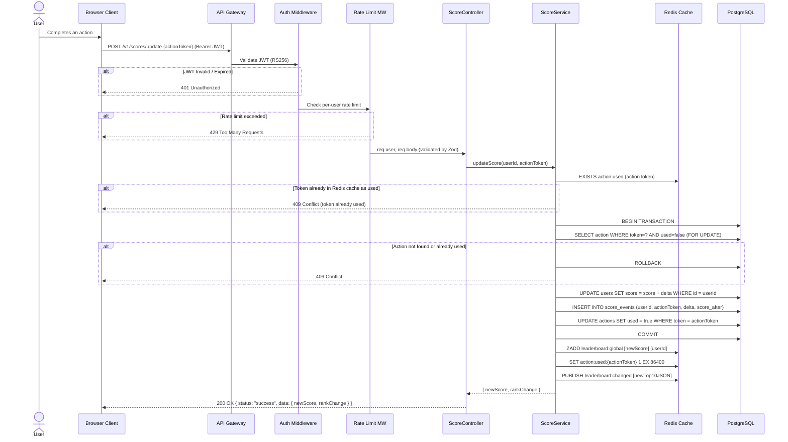
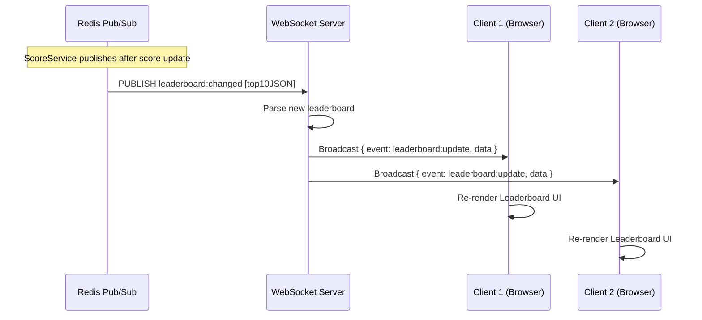
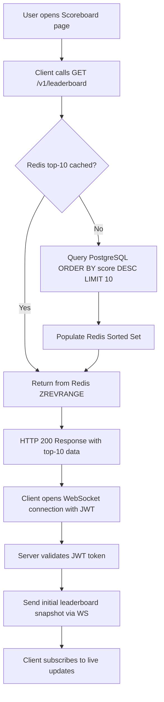

# Problem 6 — Scoreboard API Service Specification

> **Category:** Backend / Fullstack  
> **Author:** Senior Full-Stack Architect  
> **Version:** 1.0.0  
> **Status:** Draft — Ready for Backend Engineering Review

---

## Table of Contents

1. [Overview](#1-overview)
2. [System Architecture](#2-system-architecture)
3. [Data Models & Database Schema](#3-data-models--database-schema)
4. [API Specification](#4-api-specification)
5. [Authentication & Security Design](#5-authentication--security-design)
6. [Real-Time Live Update (WebSocket)](#6-real-time-live-update-websocket)
7. [Flow of Execution Diagrams](#7-flow-of-execution-diagrams)
8. [Error Handling Strategy](#8-error-handling-strategy)
9. [Caching Strategy](#9-caching-strategy)
10. [Improvement Suggestions](#10-improvement-suggestions)

---

## 1. Overview

This document specifies the **Scoreboard API Module** — a backend service responsible for:

- Maintaining a **live top-10 leaderboard** of user scores.
- Accepting **authenticated score-update requests** triggered by user action completions.
- **Broadcasting real-time leaderboard changes** to all connected clients via WebSocket.
- **Preventing unauthorized or fraudulent score manipulation**.

### High-Level Philosophy

The module is designed with a **3-tier clean architecture**:

```
Client (Browser) ──► API Gateway / Load Balancer
                          │
                    ┌─────┴──────┐
                    │  REST API  │  (HTTP — score update, leaderboard fetch)
                    │  WS Server │  (WebSocket — live leaderboard push)
                    └─────┬──────┘
                          │
                    ┌─────┴─────┐
                    │  Service  │  (Business Logic — score validation, ranking)
                    └─────┬─────┘
                          │
               ┌──────────┴──────────┐
               │  Redis (Cache)      │  (Top-10 sorted set, rate-limit counters)
               │  PostgreSQL (RDBMS) │  (Persistent score records, audit log)
               └─────────────────────┘
```

---

## 2. System Architecture

### 2.1 Technology Stack

| Layer           | Technology                       | Rationale                                       |
| --------------- | -------------------------------- | ----------------------------------------------- |
| Runtime         | Node.js 20 LTS                   | Non-blocking I/O, ideal for real-time workloads |
| Framework       | Express.js + `ws` (WebSocket)    | Lightweight, composable                         |
| Language        | TypeScript (strict mode)         | Type safety, zero `any`                         |
| Database        | PostgreSQL                       | ACID compliance, reliable for score ledger      |
| Cache / Ranking | Redis (Sorted Sets)              | O(log N) rank queries, native pub/sub           |
| ORM             | Prisma                           | Type-safe DB access, migration management       |
| Auth            | JWT (RS256) via HTTP-only cookie | Secure, prevents XSS token theft                |
| Validation      | Zod                              | Runtime schema validation at the boundary layer |
| Logging         | Pino                             | Structured JSON logs, low overhead              |
| Rate Limiting   | `express-rate-limit` + Redis     | Distributed rate limiting across instances      |

### 2.2 Deployment Architecture

```
                        ┌────────────────────┐
                        │   CDN / Nginx      │
                        │  (Static Assets,   │
                        │   SSL Termination) │
                        └────────┬───────────┘
                                 │
                    ┌────────────▼────────────────┐
                    │       API Gateway           │
                    │  (Rate Limit, Auth Header   │
                    │   Validation, Routing)      │
                    └──────┬───────────┬──────────┘
                           │           │
              ┌────────────▼──┐   ┌────▼───────────────┐
              │  REST Service │   │  WebSocket Service │
              │  :3000        │   │  :3001             │
              └──────┬────────┘   └────┬───────────────┘
                     │                  │
              ┌──────▼──────────────────▼───────┐
              │           Service Layer         │
              │     ScoreService, RankService   │
              └──────┬──────────────────┬───────┘
                     │                  │
             ┌───────▼───────┐  ┌───────▼────────┐
             │  PostgreSQL   │  │    Redis       │
             │  (Ledger DB)  │  │  (Score Cache) │
             └───────────────┘  └────────────────┘
```

---

## 3. Data Models & Database Schema

### 3.1 PostgreSQL Tables

#### `users`

```sql
CREATE TABLE users (
  id          UUID PRIMARY KEY DEFAULT gen_random_uuid(),
  username    VARCHAR(50) UNIQUE NOT NULL,
  email       VARCHAR(255) UNIQUE NOT NULL,
  password_hash TEXT NOT NULL,
  score       BIGINT NOT NULL DEFAULT 0,
  created_at  TIMESTAMPTZ NOT NULL DEFAULT NOW(),
  updated_at  TIMESTAMPTZ NOT NULL DEFAULT NOW()
);

CREATE INDEX idx_users_score ON users (score DESC);
```

#### `score_events` (Audit Log)

```sql
CREATE TABLE score_events (
  id            UUID PRIMARY KEY DEFAULT gen_random_uuid(),
  user_id       UUID NOT NULL REFERENCES users(id) ON DELETE CASCADE,
  action_token  VARCHAR(255) NOT NULL UNIQUE,  -- idempotency key
  delta         INTEGER NOT NULL CHECK (delta > 0),
  score_after   BIGINT NOT NULL,
  ip_address    INET,
  user_agent    TEXT,
  created_at    TIMESTAMPTZ NOT NULL DEFAULT NOW()
);

CREATE INDEX idx_score_events_user_id ON score_events (user_id);
CREATE INDEX idx_score_events_action_token ON score_events (action_token);
```

> **Design note:** `action_token` enforces **idempotency** — the same action cannot be submitted twice, preventing replay attacks.

### 3.2 Redis Data Structures

| Key Pattern                 | Type       | Purpose                                      |
| --------------------------- | ---------- | -------------------------------------------- |
| `leaderboard:global`        | Sorted Set | Top-N scores (score as rank weight)          |
| `ratelimit:{userId}:score`  | String+TTL | Per-user rate limit counter (sliding window) |
| `action:used:{actionToken}` | String+TTL | Idempotency check cache (TTL: 24h)           |

### 3.3 TypeScript DTO Contracts

```typescript
// Shared between Frontend and Backend (monorepo: packages/shared-types)

export interface User {
  id: string;
  username: string;
  score: number;
}

export interface LeaderboardEntry {
  rank: number;
  userId: string;
  username: string;
  score: number;
}

// POST /api/scores/update
export interface UpdateScoreRequest {
  actionToken: string; // Unique one-time token proving action completion
}

export interface UpdateScoreResponse {
  status: "success";
  data: {
    newScore: number;
    rankChange: number | null;
  };
  message: string;
}

// WebSocket message envelope
export type WsServerMessage =
  | { event: "leaderboard:update"; data: LeaderboardEntry[] }
  | { event: "score:updated"; data: { userId: string; newScore: number } };

export type ApiState = "idle" | "loading" | "success" | "error";
```

---

## 4. API Specification

### Base URL

```
https://api.yourdomain.com/v1
```

### 4.1 Endpoints

---

#### `GET /leaderboard`

Fetch the current top-10 leaderboard.

**Auth:** Not required (public endpoint)

**Response `200 OK`:**

```json
{
  "status": "success",
  "data": [
    { "rank": 1, "userId": "uuid-...", "username": "alice", "score": 9800 },
    { "rank": 2, "userId": "uuid-...", "username": "bob", "score": 9200 }
  ],
  "message": "Top 10 leaderboard fetched successfully"
}
```

**Caching:** Redis Sorted Set read — O(log N + K) where K=10 (near instant).

---

#### `POST /scores/update`

Submit a completed action to increase the user's score.

**Auth:** Required — JWT Bearer token (RS256) in `Authorization` header.

**Request Body:**

```json
{
  "actionToken": "unique-one-time-token-from-action-system"
}
```

**Zod Validation Schema:**

```typescript
const UpdateScoreSchema = z.object({
  actionToken: z.string().uuid("actionToken must be a valid UUID"),
});
```

**Response `200 OK`:**

```json
{
  "status": "success",
  "data": {
    "newScore": 5600,
    "rankChange": 2
  },
  "message": "Score updated successfully"
}
```

**Response `409 Conflict`** (replayed/already used token):

```json
{
  "status": "error",
  "message": "Action token has already been used"
}
```

**Response `429 Too Many Requests`:**

```json
{
  "status": "error",
  "message": "Rate limit exceeded. Please slow down."
}
```

---

#### `GET /scores/me`

Fetch the authenticated user's current score and rank.

**Auth:** Required — JWT Bearer token.

**Response `200 OK`:**

```json
{
  "status": "success",
  "data": {
    "userId": "uuid-...",
    "username": "alice",
    "score": 5600,
    "rank": 7
  },
  "message": "User score fetched successfully"
}
```

---

### 4.2 Standard Response Envelope

All endpoints return a consistent response envelope:

```typescript
type ApiResponse<T> =
  | { status: "success"; data: T; message: string }
  | { status: "error"; message: string; code?: string };
```

---

## 5. Authentication & Security Design

### 5.1 JWT Authentication Flow

```
1. User logs in via POST /auth/login
2. Server validates credentials, issues:
   - Access Token  (JWT RS256, expires: 15 min) — stored in Authorization header
   - Refresh Token (opaque, expires: 7 days)   — stored in HttpOnly cookie
3. Client sends Access Token in every score-update request:
   Authorization: Bearer <accessToken>
4. Auth Middleware:
   a. Verifies JWT signature (RS256 public key)
   b. Checks token expiry
   c. Extracts userId from payload, attaches to req.user
```

### 5.2 Score Manipulation Prevention — Defence in Depth

| Threat                               | Countermeasure                                              |
| ------------------------------------ | ----------------------------------------------------------- |
| Unauthenticated request              | JWT middleware — reject without valid token (401)           |
| Replay attack (re-submitting action) | `action_token` uniqueness constraint (DB + Redis cache)     |
| Brute-force / bot score boosting     | Per-user rate limit: max 10 score updates per minute        |
| Token theft via XSS                  | Short-lived access tokens (15 min), HttpOnly refresh cookie |
| Score delta manipulation             | Server-side delta lookup — client never sends score delta   |
| CSRF on cookie-based flows           | SameSite=Strict cookie attribute + CSRF tokens              |
| SQL Injection                        | Prisma ORM parameterized queries                            |
| Malformed payloads                   | Zod schema validation at middleware layer                   |
| DDoS / abuse                         | Global rate limit via API Gateway + Redis sliding window    |

### 5.3 Action Token Design

The `actionToken` is a **single-use, server-issued UUID** created when the backend action system triggers an action assignment. The token:

- Is issued by the **Action Service** (separate bounded context), not by the client.
- Is stored with a `used = false` flag in the DB.
- Is marked `used = true` atomically when the score update is processed (using a DB transaction).
- Is cached in Redis for 24h to short-circuit duplicate check before hitting the DB.

> **Critical:** The client **never** controls the score delta. The server maps `actionToken → fixedDelta` from its own configuration. This prevents a malicious user from inflating the delta.

---

## 6. Real-Time Live Update (WebSocket)

### 6.1 Connection Lifecycle

```
Client                        WebSocket Server
  │                                  │
  │──── WS Handshake ───────────────►│
  │      (ws://api.../ws?token=JWT)  │
  │                                  │── Validate JWT ──►
  │◄─── Connection Accepted ─────────│
  │                                  │
  │◄─── { event: 'leaderboard:update', data: [...] }  (initial snapshot)
  │                                  │
  │                               [Score update happens via REST]
  │◄─── { event: 'leaderboard:update', data: [...] }  (broadcast to ALL)
  │                                  │
  │──── Ping ───────────────────────►│
  │◄─── Pong ────────────────────────│
  │                                  │
  │──── Close ──────────────────────►│
```

### 6.2 Redis Pub/Sub for Multi-Instance Broadcast

When running multiple Node.js instances behind a load balancer, a single machine cannot broadcast to clients on other instances. **Redis Pub/Sub** solves this:

```
Score Update (Instance A)
        │
        ▼
  Redis Channel: "leaderboard:changed"
        │
        ├──► Instance A WebSocket Server broadcasts to its clients
        ├──► Instance B WebSocket Server broadcasts to its clients
        └──► Instance C WebSocket Server broadcasts to its clients
```

```typescript
// Publisher (inside ScoreService after update)
await redisPublisher.publish("leaderboard:changed", JSON.stringify(newTop10));

// Subscriber (WebSocket server, runs on every instance)
redisSubscriber.subscribe("leaderboard:changed", (message) => {
  const leaderboard = JSON.parse(message);
  broadcastToAllClients({ event: "leaderboard:update", data: leaderboard });
});
```

---

## 7. Flow of Execution Diagrams

### 7.1 Score Update Flow (REST)



---

### 7.2 Live Leaderboard Update via WebSocket



---

### 7.3 Initial Page Load Flow



---

## 8. Error Handling Strategy

### 8.1 Custom AppError Class

```typescript
export class AppError extends Error {
  public readonly statusCode: number;
  public readonly isOperational: boolean;
  public readonly code: string;

  constructor(message: string, statusCode: number, code: string) {
    super(message);
    this.statusCode = statusCode;
    this.isOperational = true;
    this.code = code;
    Error.captureStackTrace(this, this.constructor);
  }
}

// Usage examples
new AppError("Action token already used", 409, "TOKEN_ALREADY_USED");
new AppError("Invalid or expired token", 401, "AUTH_INVALID_TOKEN");
new AppError("Rate limit exceeded", 429, "RATE_LIMIT_EXCEEDED");
```

### 8.2 Global Error Middleware

```typescript
const globalErrorHandler: ErrorRequestHandler = (err, req, res, next) => {
  const logger = req.app.locals.logger as pino.Logger;

  if (err instanceof AppError && err.isOperational) {
    logger.warn({ code: err.code, statusCode: err.statusCode }, err.message);
    return res.status(err.statusCode).json({
      status: "error",
      message: err.message,
      code: err.code,
    });
  }

  // Unexpected / programming errors — mask from client
  logger.error({ err }, "Unexpected error");
  return res.status(500).json({
    status: "error",
    message: "An internal server error occurred.",
  });
};
```

---

## 9. Caching Strategy

### 9.1 Redis Sorted Set for Leaderboard

- **Key:** `leaderboard:global`
- **Operation:** `ZADD leaderboard:global <score> <userId>` after each score update (O(log N))
- **Read:** `ZREVRANGE leaderboard:global 0 9 WITHSCORES` (O(log N + 10))
- **Benefit:** Eliminates full-table DB sort query on every page load or WS broadcast.

### 9.2 Cache Invalidation

The leaderboard cache in Redis is **incrementally updated** (not invalidated and rebuilt) on every score change:

- This is more efficient than cache-bust-on-write for a frequently updated sorted set.
- No stale reads since the sorted set IS the authoritative ranking layer.
- PostgreSQL remains the **source of truth** for persistent, auditable score records.

---

## 10. Improvement Suggestions

These are architectural improvements recommended beyond the base specification:

### 10.1 Action Token Issuance (Bounded Context Separation)

> Currently implied that the "Action System" issues tokens. This should be a **separate microservice** or at minimum a separate module with its own table, preventing the Scoreboard module from knowing the specifics of actions.

### 10.2 Score Delta Configuration (Server-Side)

> Never allow clients to specify score delta. Maintain a server-side `action_types` table:

```sql
CREATE TABLE action_types (
  id    UUID PRIMARY KEY,
  name  VARCHAR(100) UNIQUE NOT NULL,
  delta INTEGER NOT NULL CHECK (delta > 0)
);
```

> The `actionToken` maps to an `action_type_id` which then determines the delta atomically on the server.

### 10.3 Leaderboard Pagination (Future Scale)

> When the feature grows beyond top-10, implement cursor-based pagination on the leaderboard endpoint to support infinite scroll without offset performance penalties.

### 10.4 Event Sourcing for Score History

> Replace direct `score` column mutation with an **event-sourced ledger** approach (the `score_events` table already supports this). The score becomes a **projection** of all past events. This enables:
>
> - Complete audit trail
> - Replay-able state reconstruction
> - Easier cheat detection (anomalous delta spikes)

### 10.5 Anomaly Detection / Anti-Cheat Layer

> Introduce an async anomaly detection service using a message queue (e.g., BullMQ + Redis) that analyzes score event patterns:

```
Score Update ──► DB Write ──► Publish to Queue ──► Anomaly Service
                                                        │
                                              (async, off the critical path)
                                                        │
                                              Flag suspicious users
                                              Trigger manual review
```

### 10.6 Observability

- **Distributed Tracing:** Use `opentelemetry-node` to trace requests across REST → Service → DB → Redis → WebSocket.
- **Metrics:** Expose Prometheus metrics (`/metrics` endpoint) for:
  - `score_updates_total` (counter)
  - `leaderboard_fetch_duration_ms` (histogram)
  - `ws_connected_clients` (gauge)
  - `rate_limit_rejected_total` (counter)

### 10.7 Horizontal Scaling Consideration

> The WebSocket server is stateful. To scale horizontally:
>
> - Use **Redis Pub/Sub** (already specified in §6.2) for cross-instance broadcasting.
> - Consider **Socket.IO with Redis Adapter** as a drop-in solution covering reconnection, rooms, and namespaces.
> - If extreme scale is needed, evaluate **dedicated WebSocket infrastructure** (e.g., Ably, Pusher, or AWS API Gateway WebSocket).

---

## Appendix: Project Folder Structure (Recommended)

```
src/problem6/
├── README.md                   ← This file
├── package.json
├── tsconfig.json
├── src/
│   ├── server.ts               ← App bootstrap, middlewares, route mounting
│   ├── config/
│   │   └── env.ts              ← Zod-validated environment config
│   ├── routes/
│   │   ├── leaderboard.routes.ts
│   │   └── score.routes.ts
│   ├── controllers/
│   │   ├── leaderboard.controller.ts
│   │   └── score.controller.ts
│   ├── services/
│   │   ├── score.service.ts
│   │   └── leaderboard.service.ts
│   ├── repositories/
│   │   ├── user.repository.ts
│   │   └── score-event.repository.ts
│   ├── middleware/
│   │   ├── auth.middleware.ts
│   │   ├── rate-limit.middleware.ts
│   │   ├── validate.middleware.ts
│   │   └── error.middleware.ts
│   ├── websocket/
│   │   └── leaderboard.ws.ts   ← WS server, Redis Pub/Sub subscriber
│   ├── database/
│   │   ├── prisma.client.ts
│   │   └── redis.client.ts
│   ├── errors/
│   │   └── app.error.ts
│   ├── types/
│   │   └── index.ts            ← Shared DTOs, discriminated unions
│   └── utils/
│       ├── logger.ts           ← Pino structured logger
│       └── response.helper.ts  ← Standard response envelope builder
└── prisma/
    └── schema.prisma
```
